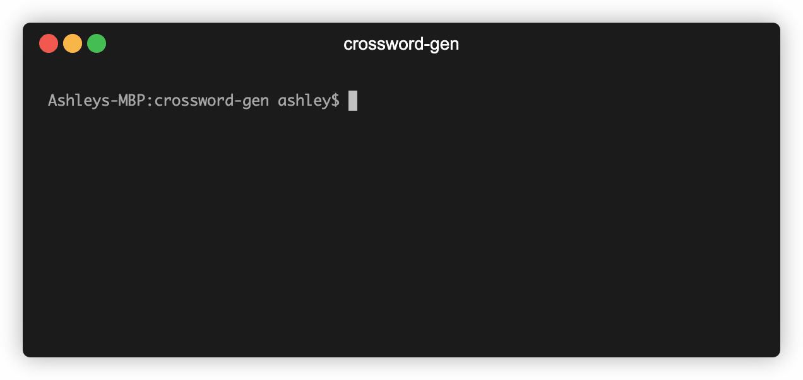

# crossword-gen

[](https://www.gnu.org/licenses/agpl-3.0) 

`cw_gen` lets you generate crossword puzzles by specifying a word list and a grid to fill in.


## 🚀 Installation


The unix binary is already included at `src/cw_gen`. To be re-build, navigate to the `src/` directory and run the build script:

```bash 
cd src
sh build.sh
```

## ⚙️ Usage



```bash
cd src
./cw_gen [OPTIONS]
```
Please note that all options are optional but must not conflict with each other if multiple are used, i.e. grid contents string length must match the puzzle size specified.

### `size`

| Option         | Description                                                                                                  | Type    | Default |
|----------------|--------------------------------------------------------------------------------------------------------------|---------|---------|
| -s, --size arg | Dimensions of the crossword to be generated, in the format `columns,rows`.  Size must be greater than size 1x1. Large sizes may take several minutes or more to solve, especially if a large dictionary is used, or if difficult or no grid contents are specified. | int,int | `4,4`     |

### `grid contents`

| Option             | Description                                                                                                                                                                                                                                                                                                  | Type   | Default |
|--------------------|--------------------------------------------------------------------------------------------------------------------------------------------------------------------------------------------------------------------------------------------------------------------------------------------------------------|--------|---------|
| -c, --contents arg | Crossword grid to fill in, from top left to bottom right by row, and contained within quotes.  Each char represents one tile and must be a set letter (`a-z`), wildcard (`?`), or black tile (single space).  Total length must equal `rows * columns`. If left unspecified, all tiles are set to wildcards. | string | none    |

### `word dictionary`

| Option        | Description                                                                                                                                                                                                                                                                                   | Type   | Default    |
|---------------|-----------------------------------------------------------------------------------------------------------------------------------------------------------------------------------------------------------------------------------------------------------------------------------------------|--------|------------|
| -d --dict arg | Word list to use. Possible options from smallest to largest are `top1000`, `top3000`, `top10000`, `crossfire`, and `all`.  Larger dictionaries are more effective for finding solutions for larger puzzles at the cost of likely increased runtime and possibly more unfamiliar words chosen. | string | `top10000` |

### `examples`

| Option            | Description                                                                                                                                                                                            | Type   | Default |
|-------------------|--------------------------------------------------------------------------------------------------------------------------------------------------------------------------------------------------------|--------|---------|
| -e, --example arg | Preset example crossword generation params, **overriding size, contents, and dictionary if specified**. Possible options are `empty`, `cross`, `bridge`, `stairs`, `donut`, `crosshair`, and `crosshair2`. | string | none    |

### `verbosity`

| Option              | Description                                                                                                                        | Type   | Default |
|---------------------|------------------------------------------------------------------------------------------------------------------------------------|--------|---------|
| -v, --verbosity arg | Minimum verbosity for print statements. Possible options in decreasing level are `fatal`, `error`, `warning`, `info`, and `debug`. | string | `fatal` |

### `help`

| Option     | Description                                                        | Type | Default |
|------------|--------------------------------------------------------------------|------|---------|
| -h, --help | Print usage to display a summary of all options, their usage, and descriptions. | none | none    |

## ✅ Tests


This project uses the [Catch2 v2.x](https://github.com/catchorg/Catch2/tree/v2.x) testing framework to test each module. To run the test suite, navigate to the `test/` directory and run the test script:

```bash
cd test
sh test.sh
```

## ⚙️ How it works

After parsing the crossword parameters, `crossword-gen` constructs a [constraint satisfaction problem (CSP)](https://en.wikipedia.org/wiki/Constraint_satisfaction_problem) that represents the crossword. CSP variables symbolize words, and their domains are initially set to all the words from the user-specified dictionary that fit in that slot. CSP constraints occur when any two variables intersect in the crossword; those two letters in each of the word variables must be equal. 

Using a combination of the [AC-3 algorithm](https://en.wikipedia.org/wiki/AC-3_algorithm) and [backtracking](https://en.wikipedia.org/wiki/Backtracking), the CSP iteratively assigns values to variables until a valid solution is found or the search space is exhausted.

## 💡 Future work

- Incorporate word frequency or other scoring heuristics into word selection to create minimize unfamiliar words used and speed up generation
- Explore alternatives to arc consistency such as path consistency to improve CSP simplification performance
- Investigate different CSP solving options in addition to backtracking like the VLNS method, local search, and/or linear programming
- Upgrade CSPs to be [dynamic CSPs](https://en.wikipedia.org/wiki/Constraint_satisfaction_problem#Dynamic_CSPs) to allow insertion of black tiles to complete crosswords. This will minimize user effort required to avoid impossible crossword grid patterns 
- Clue generation/lookup
- Add quality-of-life features like a progress bar during puzzle generation